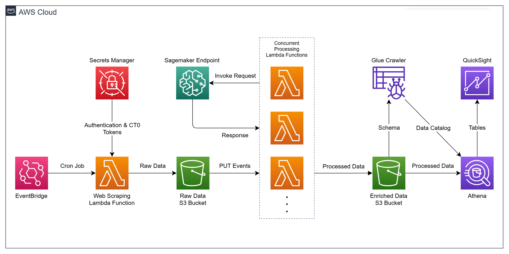
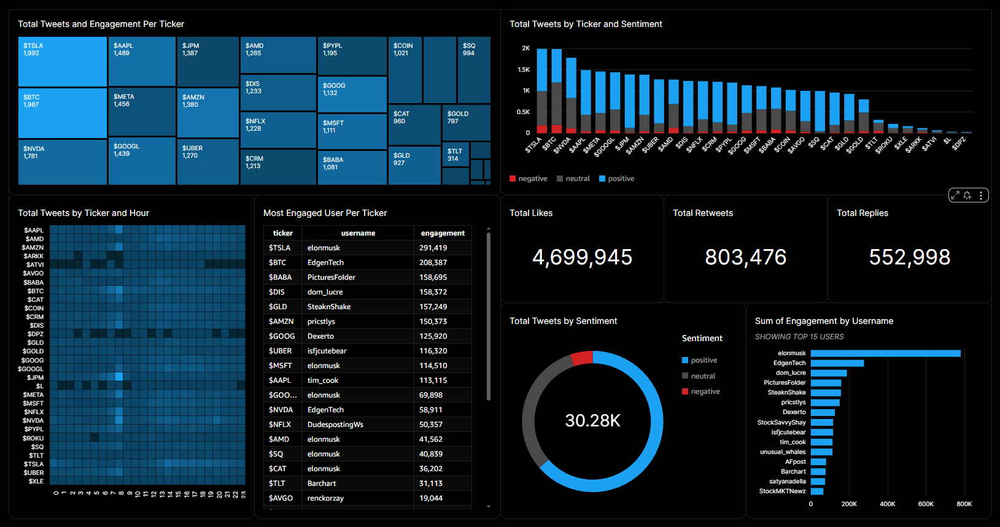

# AWS-native ELT Pipeline for Stock Market Sentiment Analysis from X

This project implements a serverless, event-driven, and cost-optimized ELT pipeline on AWS for stock market sentiment analysis** using tweets from [X (formerly Twitter)](https://x.com).
It automatically scrapes the top 30 tickers from [Finder](https://www.finder.com/ca/stock-trading/top-trending-stocks-on-twitter), uses twscrape and BeautifulSoup to scrape trending tweets for each ticker and enriches tweet data with sentiment scores using a [RoBERTa-base model](https://huggingface.co/cardiffnlp/twitter-roberta-base-sentiment-latest) via SageMaker, and delivers queryable and visual insights using Athena and QuickSight.

This pipeline demonstrates how to combine data engineering, serverless compute, MLOps and data analytics in a production-ready, cloud-native architecture.

## Architecture Overview



**Workflow:**
1. **Extract**
   - X accounts' authentication & CT0 tokens are stored in Secrets Manager.
   - EventBridge (cron job) triggers a scraping Lambda everyday at 12:00 PM.
   - Lambda starts by scraping the top 30 tickers from Finder.
   - Then, Lambda collects the tokens for 5 cycling X accounts and scrapes tweets using twscrape and BeautifulSoup.

2. **Load**  
   - Tweets are stored in JSON format and stored in an S3 bucket.
   - Each S3 PUT event triggers the transformation stage automatically, invoking a Lambda for each PUT. 

3. **Transform**  
   - A processing Lambda invokes a SageMaker Endpoint to a RoBERTa-base sentiment model.  
   - Each tweet is enriched with sentiment (positive/negative/neutral) and a confidence score.  
   - Enriched data is written to a new S3 bucket in form of JSON files.  

5. **Analytics & Visualization**  
   - Glue Crawler infers schema from enriched data.  
   - Athena enables SQL queries on tweets by creating a table from the JSON files. 
   - An interactive dashboard is created on QuickSight for stock market sentiment analysis.


## AWS Services Used
- **EventBridge:** scheduling  
- **Lambda:** scraping + enrichment  
- **Secrets Manager:** secure credential storage  
- **S3:** raw + enriched data lake storage  
- **SageMaker Endpoint:** ML inference (sentiment analysis)  
- **Glue Data Catalog:** schema management  
- **Athena:** serverless SQL queries  
- **QuickSight:** sentiment dashboard

## Why ELT?
This pipeline follows the **ELT (Extract → Load → Transform)** model:  
- **Extract:** Tweets are scraped from X.  
- **Load:** Raw data lands in S3 without transformation.  
- **Transform:** Enrichment (sentiment scoring) happens after loading, within AWS.  
- **Query/Visualize:** Athena + QuickSight deliver insights.  

This ensures scalability, flexibility, and lower costs compared to heavy ETL jobs.  

## Dashboard


## Repo Structure
```text
├── images/  
│   ├── architecture.png          # AWS pipeline architecture diagram
│   └── dashboard.png             # Analytics dashboard using Quicksight
│
├── lambda/  
│   ├── scraping_lambda.py        # Lambda function to scrape trending stock tickers & tweets  
│   └── enrichment_lambda.py      # Lambda function to enrich tweets with sentiment (via SageMaker)  
│
├── sagemaker/  
│   └── deploy_model.py           # Script to deploy the sentiment analysis model as a SageMaker endpoint  
│
├── sample_data/  
│   ├── raw/                      # Example of scraped raw JSON tweets  
│   │   └── NVDA-2025-08-29.json  
│   └── enriched/                 # Example of enriched JSON with sentiment + score  
│       └── NVDA-2025-08-29.json  
│
└── cloudformation_iac.yaml       # IaC template for Cloudformation generated by Former2
